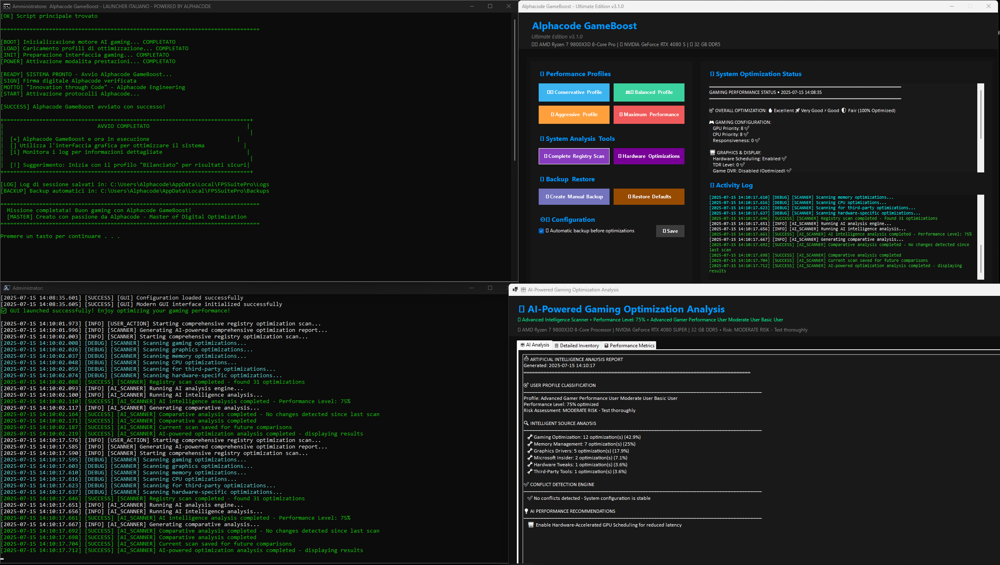
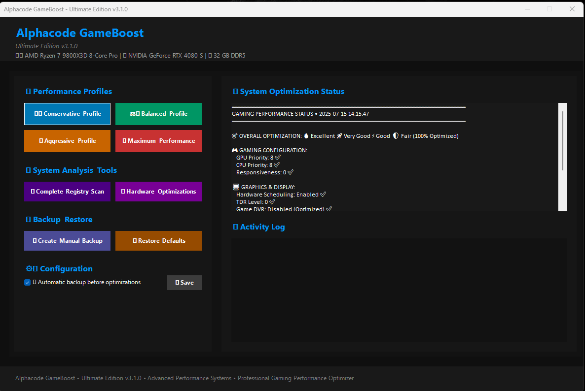
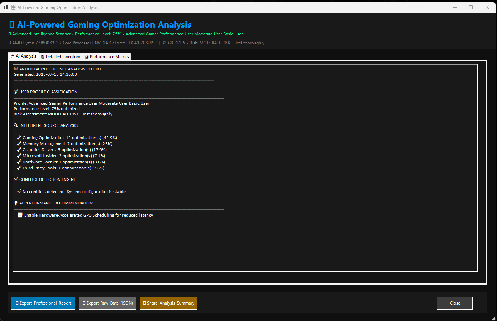
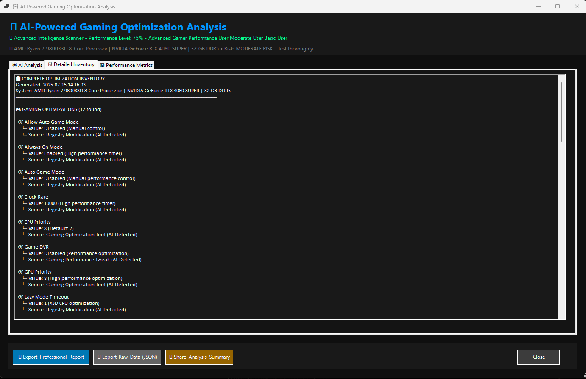
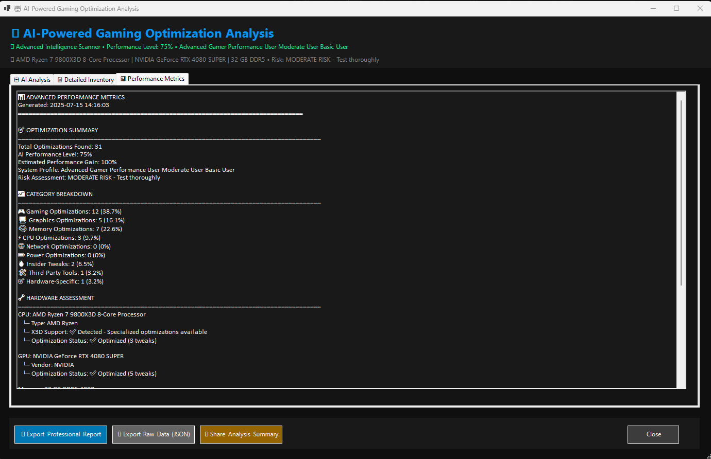

> **Ultimate Edition v3.1.0 — Advanced Gaming Performance Suite**  
> _The all-in-one gaming optimizer for Windows 10/11 — powered by Alphacode_

---

## 🚀 Cos'è Alphacode GameBoost?

**Alphacode GameBoost** è la suite definitiva per spremere ogni FPS dal tuo PC Windows grazie a profili di ottimizzazione avanzati, analisi AI, backup e tweak automatici.  
Ideale per gamer competitivi, smanettoni e chiunque voglia il massimo dal proprio hardware.

---

## 🖥️ Requisiti

- **Sistema operativo:** Windows 10/11 (x64)
- **PowerShell:** v5.0 o superiore (integrato in Windows 10+)
- **Permessi:** Avviare come Amministratore per tutte le funzioni
- **Connessione internet:** consigliata per analisi AI dinamica

---

## 🎮 Funzionalità principali

- Profili di ottimizzazione: Conservative, Balanced, Aggressive, Maximum Performance
- Tuning automatico dei parametri hardware/software
- Analisi avanzata dello stato di sistema e registro
- Backup e ripristino delle configurazioni
- Compatibilità AMD, Intel, NVIDIA/AMD GPU
- Log dettagliato, suggerimenti AI-driven, GUI moderna

---

## 📦 Download & Quick Start

1. **Scarica gli script** (`.ps1`, `.bat`) dal [repository](https://github.com/pinksy91/Alphacode_GameBoost)
2. Avvia `Alphacode_GameBoost.bat` come **amministratore** (tasto destro → “Esegui come amministratore”)
3. Seleziona un profilo, ottimizza e monitora l’attività

> **Consiglio:** Effettua un backup automatico dal tool prima di qualsiasi ottimizzazione avanzata.

---

## 📸 Screenshot

**Dashboard Principale**

**Ottimizzazione Stato Sistema**

**Dettaglio Analisi AI**

**Performance Metrics e Suggerimenti**

---

## ❓ FAQ

**Il tool è reversibile?**  
Sì, puoi effettuare il backup della configurazione originale e ripristinarla in qualsiasi momento tramite la funzione integrata.

**Funziona anche su Windows 11?**  
Assolutamente sì! Testato e ottimizzato sia per Windows 10 che 11.

**Serve disattivare l’antivirus?**  
No, ma alcuni antivirus potrebbero segnalare falsi positivi a causa dei comandi avanzati. Se accade, aggiungi il tool alle eccezioni.

**Il tool è sicuro?**  
Tutte le ottimizzazioni sono documentate e reversibili. Codice open source e ispezionabile da chiunque.

**Supporta hardware AMD/Intel/NVIDIA?**  
Sì, supporto completo e tuning dedicato anche per le ultime generazioni di CPU e GPU.

**Come si disinstalla/ripristina?**  
Basta ripristinare il backup dal menu del tool o annullare le modifiche tramite le opzioni disponibili.

---

## 👤 Autore

**Alphacode**  
Tweaker nel DNA. Modding, script, overclock, automazione: se si può ottimizzare, lo faccio.  
[GitHub](https://github.com/Alphacode)

---

## 📄 Licenza

[MIT](LICENSE)

---

## ❤️ Supporto & contatti

- GitHub: [Alphacode](https://github.com/Alphacode)

---

## ⭐️ Lascia una stella se ti piace!

---

