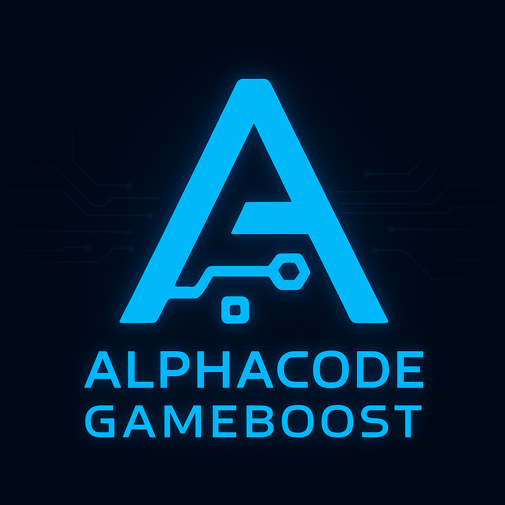

<p align="center">
  
</p>

<h1 align="center">Alphacode GameBoost</h1>

<p align="center">
  <strong>Next-Gen Edition v3.3.0 — Gaming Optimizer AI-Powered, 100% Local, Privacy-First</strong><br>
  Intelligent all-in-one gaming optimizer for Windows 10/11 — powered by <a href="https://github.com/Alphacode" target="_blank"><strong>Alphacode</strong></a>
</p>

<p align="center">
  <a href="https://github.com/Alphacode"></a>
  
  
  <a href="LICENSE"></a>
</p>

---

## 🚀 Cos'è Alphacode GameBoost?

**Alphacode GameBoost** è una suite definitiva e modulare per l’ottimizzazione delle prestazioni gaming su Windows. Pensata per gamer competitivi, enthusiast, content creator e power user che vogliono **spingere ogni componente al massimo** con sicurezza, backup e analisi AI.

* 🎮 Profili: Conservative, Balanced, Aggressive, Maximum
* 🧠 Analisi AI real-time: detection, raccomandazioni, report
* 🔧 Tweaks avanzati: CPU, GPU, memoria, rete, registry
* 💾 Backup/Ripristino automatici e selettivi
* 🖥️ GUI moderna con log, progressi, status e quick actions
* 🏆 Compatibilità next-gen: Zen 5, Arrow Lake, RTX 5090, RX 9000, Battlemage

---

## 🖥️ Requisiti di Sistema

* **OS**: Windows 10 (19041+) o 11 (solo x64)
* **PowerShell**: v5.1+ (meglio v7)
* **Permessi**: Amministratore
* **Spazio**: 50 MB liberi (backup/log)
* **Connessione Internet**: solo per aggiornamenti/AI (opzionale)
* **Antivirus**: Consigliata esclusione della cartella del tool

---

## 🏗️ Struttura del Repository

```text
Alphacode_GameBoost/
├── assets/                # Logo e screenshots
├── modules/
│   ├── FPS_Suite_Advanced_Gaming_module.ps1
│   └── FPS_Suite_ScanUltimate_AI.ps1
├── src/                   # [NEW v3.3.0] Next-gen modules
│   ├── detection/
│   │   └── game-detector.ps1        # Smart game detection
│   ├── ui/
│   │   └── tray-integration.ps1     # System tray UI
│   ├── monitoring/
│   │   └── performance-monitor.ps1  # WMI performance tracking
│   ├── scheduler/
│   │   └── smart-scheduler.ps1      # Pattern learning & suggestions
│   ├── safety/
│   │   ├── tweak-registry.ps1       # Tweak classification database
│   │   ├── user-consent.ps1         # Consent dialogs
│   │   └── tweak-applicator.ps1     # Safe tweak application
│   └── orchestrator.ps1             # Unified launcher
├── data/
│   └── games.json         # [NEW] 30+ game database
├── config/
│   └── app.config.json    # Centralized configuration
├── tests/
│   └── unit/
│       └── core.tests.ps1 # Pester test suite
├── .github/workflows/
│   └── test.yml           # CI/CD pipeline
├── Alphacode_GameBoost.bat
├── README.md
├── CHANGELOG.md           # [UPDATED v3.3.0]
├── SECURITY.md
└── LICENSE
```

---

## 🚦 Installazione & Primo Avvio

### 1. Download

git clone [https://github.com/pinksy91/Alphacode\_GameBoost.git](https://github.com/pinksy91/Alphacode_GameBoost.git) oppure scarica lo ZIP ed estrai la cartella dove preferisci

### 2. Avvio

* Vai nella cartella estratta
* **Tasto destro su** `Alphacode_GameBoost.bat` → **Esegui come amministratore**
* Segui le istruzioni su schermo: viene avviata la GUI e richiesto il profilo da usare (Balanced consigliato per la prima volta)

### 3. Sicurezza

* **Backup automatico** prima di ogni ottimizzazione
* **Restore 1-click** sempre disponibile

---

## 📸 Screenshot

<p align="center">
  <br>
  <b>Dashboard Principale</b>
</p>
<p align="center">
  <br>
  <b>Stato Ottimizzazione</b>
</p>
<p align="center">
  <br>
  <b>AI Scanner</b>
</p>
<p align="center">
  <br>
  <b>Result Screen</b>
</p>

---


## 🎮 Profili di Ottimizzazione

| Profilo          | Descrizione breve                          | Target               | Rischio     |
| ---------------- | ------------------------------------------ | -------------------- | ----------- |
| 🛡️ Conservative | Ottimizzazioni leggere e sicure            | Principianti, lavoro | Molto basso |
| ⚖️ Balanced      | Equilibrio tra prestazioni e stabilità     | Gaming, daily use    | Basso       |
| 🚀 Aggressive    | Prestazioni elevate, stabilità accettabile | Gaming competitivo   | Moderato    |
| 🔥 Maximum       | Massime performance, richiede monitoraggio | Enthusiast, OC       | Alto        |

---

## 🧠 Analisi AI e Scanner Intelligente

* **Auto-detection**: CPU, GPU, RAM, compatibilità
* **Conflitti**: Segnala ottimizzazioni incompatibili o rischiose
* **Suggerimenti**: Profilo ideale, tweak consigliati
* **Report**: Esportazione log, backup, comparativa avanzata
* **Export JSON**: Dati raw per troubleshooting/analisi

---

## 🔧 Ottimizzazioni Disponibili

### Gaming & System

* **GPU/CPU Priority**: Scheduling e boost prestazioni
* **System Responsiveness**: Latenza minima
* **GameDVR Off**, Hardware Scheduling On, DWM Tweaks, TDR Level

### Memoria & Storage

* **Paging Executive**, **Large System Cache**
* **Memory Compression Off**, **Prefetch Tuning**

### CPU & Processo

* **Processor Parking Off**, **Priority Separation**
* **Interrupt Handling**, **Timer ad alta risoluzione**

### Rete

* **TCP Optimizations** (CTCP, ECN)
* **Network Throttling Off**
* **DNS Caching, QoS Gaming**

### Backup e Restore

* **Automatici e timestamped**
* **Restore totale/selettivo**
* **Verifica integrità backup**

---

## 🧬 Compatibilità Hardware

CPU:

* AMD Ryzen 5000/7000/8000/9000 (Zen 3/4/5/X3D)
* Intel 12/13/14 Gen, Arrow Lake (K, HX, H)

GPU:

* NVIDIA RTX 30/40/50 (Blackwell incluso)
* AMD Radeon RX 6000/7000/9000 (compreso Navi 44)
* Intel ARC Alchemist, Battlemage

RAM:

* DDR4 & DDR5 

Altro:

* PCIe 5.0, USB4, Wi-Fi 6E, sistemi desktop, notebook e AIO

---

## ❓ FAQ

Le modifiche sono reversibili? Sì, ogni operazione è preceduta da backup automatico con restore immediato.

L’AI serve davvero? Il modulo AI individua criticità, conflitti, suggerisce profili e compara performance — utile per chi cerca efficienza senza rischi.

Il tool è sicuro? Tutto open source, niente telemetria, niente tracking. Ispeziona ogni script liberamente.

Supporta hardware di ultima generazione? Sì, validato su Zen 5, Arrow Lake, RTX 5090, RX 9000, Battlemage.

---

## 🛠️ Troubleshooting & Log

* Execution Policy: Esegui `Set-ExecutionPolicy -ExecutionPolicy RemoteSigned` da PowerShell come admin
* Antivirus: Aggiungi esclusione per la cartella del tool
* Log: `%LOCALAPPDATA%\FPSSuitePro\Logs` Backup in `%LOCALAPPDATA%\FPSSuitePro\Backups`
* Restore: Sempre accessibile da GUI e CLI

---

## ⚠️ Avvertenze, Disclaimer e Limitazioni

**Attenzione:** Questo tool applica ottimizzazioni avanzate e modifiche profonde al sistema. Alcuni tweak sono potenti e vanno usati solo se consapevoli dei rischi: l'utilizzo improprio può causare instabilità, incompatibilità o perdita di dati.

**Utilizzi il tool a tuo rischio e pericolo.** Né lo sviluppatore, né i collaboratori, né la community sono responsabili di eventuali danni, malfunzionamenti o perdita di dati derivanti dall'uso di Alphacode GameBoost. Prima di applicare modifiche è sempre consigliato effettuare backup completi e testare su sistemi non critici.

* Crea sempre backup prima di modifiche importanti
* Testa le ottimizzazioni più spinte prima di sessioni critiche
* Il tool è pensato solo per Windows 10/11 x64
* Alcune ottimizzazioni sono hardware-dependent

---

## 🤝 Contributi

Come contribuire:

1. Fork del repo
2. Crea un branch per la tua feature/patch
3. Testa su più sistemi
4. Documenta e invia una pull request

Bug report: Apri una Issue su GitHub, allega log, info sistema e passi per riprodurre.

---

## 📄 Licenza

Distribuito con licenza MIT.
Consulta [LICENSE](LICENSE) per dettagli.

* Uso commerciale: Consentito, con attribuzione
* Modifica e ridistribuzione: Libera, senza garanzie

---

## 👨‍💻 Credits

* Alphacode — Sviluppo, architettura, GUI, moduli AI
* Community — Testing, suggerimenti, feedback
* Microsoft — Documentazione API Windows, PowerShell
* Special Thanks: Beta tester & contributor 

---

Potenza reale. Controllo totale. Ottimizzazione consapevole. Solo con Alphacode GameBoost.

---

⭐️ Supporta il Progetto

Se il tool ti è utile lascia una ⭐ su GitHub: [https://github.com/pinksy91/Alphacode\_GameBoost](https://github.com/pinksy91/Alphacode_GameBoost) Condividi e aiutaci a migliorare con feedback!

---

Link Utili

* Repository Ufficiale: [https://github.com/pinksy91/Alphacode\_GameBoost](https://github.com/pinksy91/Alphacode_GameBoost)
* Profilo Alphacode: [https://github.com/Alphacode](https://github.com/Alphacode)
* Segnala Issue/Bug: [https://github.com/pinksy91/Alphacode\_GameBoost/issues](https://github.com/pinksy91/Alphacode_GameBoost/issues)
* Licenza MIT: LICENSE
