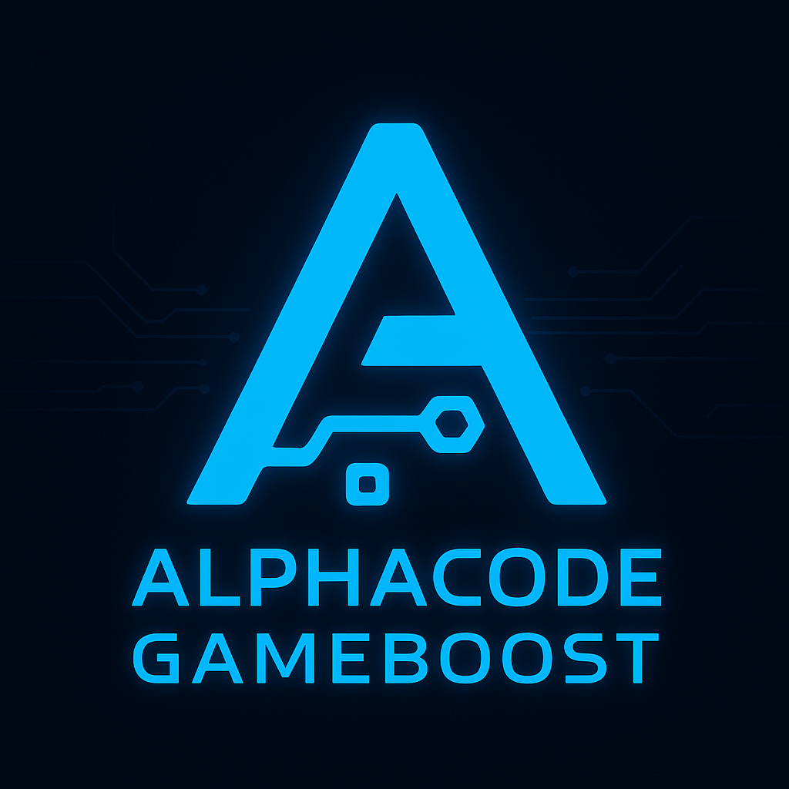
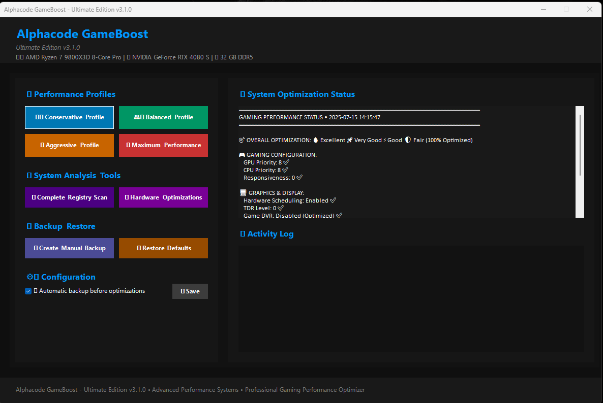
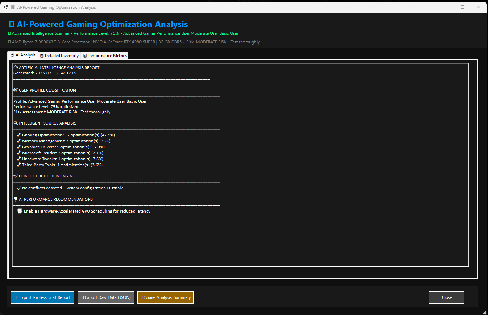
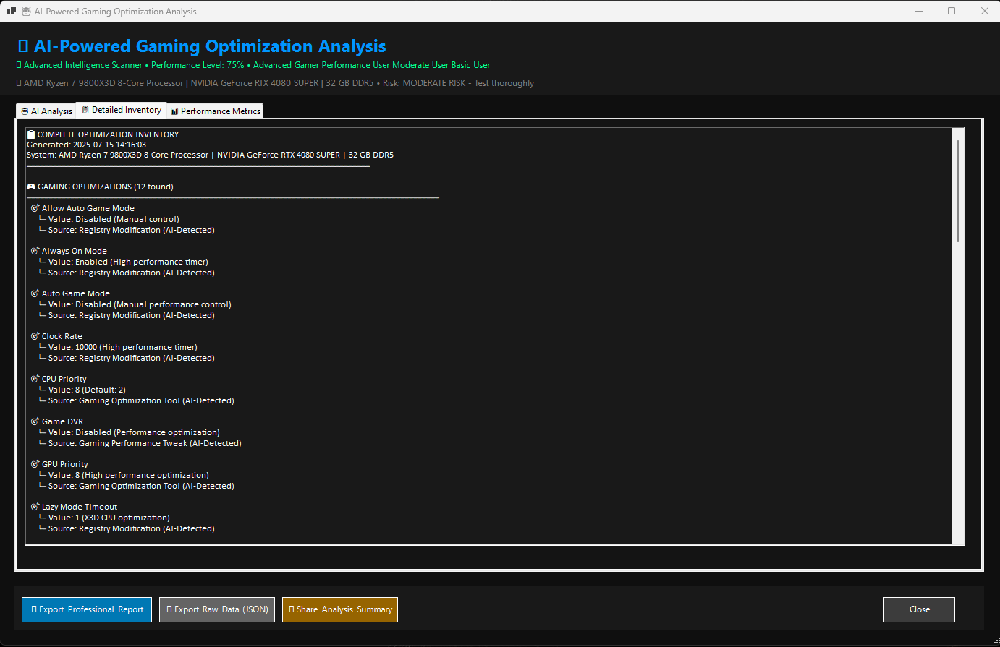
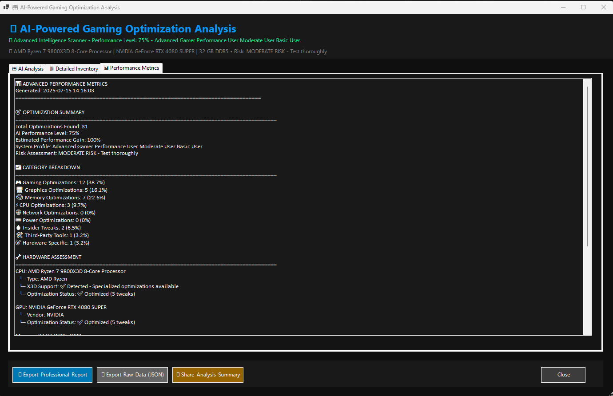

<p align="center">
  
</p>

<h1 align="center">Alphacode GameBoost</h1>

<p align="center">
  <strong>Next-Gen Edition v3.3.0 — AI-Powered Gaming Optimizer, 100% Local, Privacy-First</strong><br>
  Intelligent all-in-one gaming optimizer for Windows 10/11 — powered by <a href="https://github.com/Alphacode" target="_blank"><strong>Alphacode</strong></a>
</p>

<p align="center">
  <a href="https://github.com/Alphacode"></a>
  
  
  <a href="LICENSE"></a>
  
  
</p>

---

## 🚀 What is Alphacode GameBoost?

**Alphacode GameBoost** is the **ultimate next-generation suite** for gaming performance optimization on Windows. Designed for competitive gamers, enthusiasts, and power users who demand **maximum performance with complete security and transparency**.

> **The Reference Tool for Gamers Who Value Privacy and Performance**

### 🎯 NEW in v3.3.0 - Next-Gen Features

* 🎮 **Smart Game Detection**: Automatically recognizes 30+ popular games (CS2, Valorant, Cyberpunk, Elden Ring...)
* 🔔 **System Tray Integration**: Native Windows UI, one-click profile switching, balloon notifications
* 📊 **Performance Monitor**: Real-time CPU/GPU/RAM/Temp via WMI (zero external dependencies)
* 🔮 **Smart Scheduler**: Local pattern learning, intelligent suggestions based on your habits
* 🛡️ **User Consent System**: ALWAYS asks for confirmation, tweaks classified Safe/Warning/Dangerous
* 🔒 **Privacy-First**: 100% local, zero telemetry, no external APIs, data never leaves your PC

### ⚡ Core Features

* 🎚️ **Optimization Profiles**: Conservative, Balanced, Aggressive, Maximum
* 🔧 **Advanced Tweaks**: 13+ classified optimizations (CPU, GPU, memory, network, registry)
* 💾 **Automatic Backup/Rollback**: Every change is fully reversible
* 📜 **Complete Audit Trail**: JSONL logging of all operations
* 🧠 **Real-Time AI Analysis**: Hardware detection, personalized recommendations
* 🖥️ **Modern GUI**: Integrated logs, progress tracking, status monitoring, quick actions
* 🏆 **Next-Gen Hardware**: Zen 5, Arrow Lake, RTX 5090, RX 9000, Battlemage

---

## 🌟 Why Choose GameBoost?

| Feature | GameBoost v3.3.0 | Razer Cortex | MSI Afterburner | Game Fire |
|---------|------------------|--------------|-----------------|-----------|
| **RAM Usage** | 20MB | 150MB+ | 50MB | 80MB |
| **External Dependencies** | None | Chrome/Web | RivaTuner | Web Framework |
| **Privacy** | 100% Local | Telemetry | Local | Telemetry |
| **Game Detection** | ✅ Auto (30+) | ✅ Manual | ❌ | ✅ Limited |
| **User Consent** | ✅ Always | ⚠️ Optional | ❌ | ⚠️ Optional |
| **Open Source** | ✅ MIT | ❌ | ❌ | ❌ |
| **Audit Trail** | ✅ JSONL | ❌ | ❌ | ❌ |
| **Tweak Classification** | ✅ Safe/Warn/Danger | ❌ | ❌ | ❌ |

**GameBoost is the lightest, most transparent, and privacy-focused gaming optimizer available.**

---

## 🖥️ System Requirements

* **OS**: Windows 10 (build 19041+) or Windows 11 (x64 only)
* **PowerShell**: v5.1+ (v7 recommended for best performance)
* **Permissions**: Administrator privileges required
* **Storage**: 50 MB free space (for backups and logs)
* **Internet**: Optional (only for updates, not required for operation)
* **Antivirus**: Recommended to exclude tool folder from scans

---

## 🏗️ Repository Structure

```text
Alphacode_GameBoost/
├── assets/                # Logo and screenshots
├── modules/
│   ├── FPS_Suite_Advanced_Gaming_module.ps1
│   └── FPS_Suite_ScanUltimate_AI.ps1
├── src/                   # [NEW v3.3.0] Next-gen modules
│   ├── detection/
│   │   └── game-detector.ps1        # Smart game detection
│   ├── ui/
│   │   └── tray-integration.ps1     # System tray UI
│   ├── monitoring/
│   │   └── performance-monitor.ps1  # WMI performance tracking
│   ├── scheduler/
│   │   └── smart-scheduler.ps1      # Pattern learning & suggestions
│   ├── safety/
│   │   ├── tweak-registry.ps1       # Tweak classification database
│   │   ├── user-consent.ps1         # Consent dialogs
│   │   └── tweak-applicator.ps1     # Safe tweak application
│   └── orchestrator.ps1             # Unified launcher
├── data/
│   └── games.json         # [NEW] 30+ game database
├── config/
│   └── app.config.json    # Centralized configuration
├── tests/
│   └── unit/
│       └── core.tests.ps1 # Pester test suite (25+ tests)
├── .github/workflows/
│   └── test.yml           # CI/CD pipeline
├── Alphacode_GameBoost.bat
├── README.md              # Italian version
├── README_ENGLISH.md      # This file
├── CHANGELOG.md
├── SECURITY.md            # Security policy & tweak classification
└── LICENSE                # MIT License
```

---

## 🚦 Installation & Quick Start

### 1. Download

```bash
git clone https://github.com/pinksy91/Alphacode_GameBoost.git
```

Or download ZIP and extract to your preferred location.

### 2. Launch

* Navigate to the extracted folder
* **Right-click** on `Alphacode_GameBoost.bat` → **Run as administrator**
* Follow on-screen instructions: GUI launches and prompts for profile selection
  * **Balanced** recommended for first-time users
  * **Conservative** for stability-critical systems
  * **Aggressive** for competitive gaming
  * **Maximum** for enthusiasts (requires monitoring)

### 3. Safety First

* ✅ **Automatic backup** created before every optimization
* ✅ **1-click restore** always available from GUI
* ✅ **User consent required** - No automatic changes without approval
* ✅ **Complete transparency** - Every tweak explained in detail

---

## 📸 Screenshots

<p align="center">
  <br>
  <b>Main Dashboard - Clean Interface</b>
</p>

<p align="center">
  <br>
  <b>Real-Time Optimization Status</b>
</p>

<p align="center">
  <br>
  <b>Intelligent AI Scanner</b>
</p>

<p align="center">
  <br>
  <b>Detailed Results & Recommendations</b>
</p>

---

## 🎮 Optimization Profiles

| Profile | Description | Target Users | Performance Gain | Risk Level |
|---------|-------------|--------------|------------------|------------|
| 🛡️ **Conservative** | Light, safe optimizations | Beginners, work PCs | +5-10% FPS | Very Low |
| ⚖️ **Balanced** | Performance/stability balance | Daily gaming | +10-20% FPS | Low |
| 🚀 **Aggressive** | High performance, monitored | Competitive gaming | +20-30% FPS | Moderate |
| 🔥 **Maximum** | Maximum performance, expert | Enthusiasts, OC | +30-40% FPS | High |

> **Note**: Performance gains vary by hardware. Always benchmark before/after.

---

## 🎯 Smart Game Detection

GameBoost automatically detects and optimizes for **30+ popular games**:

### Competitive FPS
Counter-Strike 2, Valorant, Call of Duty, Rainbow Six Siege, Overwatch 2, Halo Infinite

### Battle Royale
Fortnite, Apex Legends, Warzone, PUBG

### AAA Open World
Cyberpunk 2077, GTA V, Red Dead Redemption 2, Starfield

### RPG & Action
Elden Ring, Baldur's Gate 3, The Witcher 3, Diablo IV

### MOBA
League of Legends, Dota 2

### More
Minecraft, Destiny 2, Warframe, Palworld, Rust, Rocket League, and more...

**Add custom games** with one command:
```powershell
Add-CustomGame -Name "MyGame" -ProcessName "mygame.exe" -OptimalProfile "Maximum"
```

---

## 🛡️ User Consent & Safety System

### How It Works

1. **Game Detected** → GameBoost recognizes your game
2. **Ask Permission** → "Optimize for [Game Name] with [Profile]?"
3. **Review Tweaks** → Detailed list of all changes with checkboxes
4. **User Approves** → Only selected tweaks are applied
5. **Backup Created** → Automatic backup before any change
6. **Audit Logged** → Complete record in `tweak_audit.jsonl`

### Tweak Classification

All tweaks are classified by risk level:

#### 🟢 SAFE (5 tweaks)
- Game Mode Priority Boost
- Network Optimization (TCP/IP stack)
- Mouse Acceleration Disable
- Visual Effects Reduction
- System Responsiveness

**Impact**: Fully reversible, zero stability risk

#### 🟠 WARNING (4 tweaks)
- GPU Timeout Disable (TDR)
- CPU Parking Disable
- Large System Cache
- HPET Disable

**Impact**: Reversible, may affect system behavior (16GB+ RAM recommended for some)

#### 🔴 DANGEROUS (3 tweaks)
- SEHOP Disable (security mitigation)
- Memory Integrity Disable (HVCI)
- Meltdown/Spectre Mitigations Disable

**Impact**: REDUCES SECURITY - Only for offline/air-gapped gaming PCs

**Protection**: Dangerous tweaks require typing "I UNDERSTAND THE RISKS"

---

## 📊 Performance Monitoring

### Real-Time Metrics

- **CPU**: Usage %, Temperature, Model name
- **GPU**: Name, VRAM, Usage (if available)
- **RAM**: Total, Used, Usage %
- **Historical Data**: 60-second rolling window

### Lightweight Overlay (Optional)

Transparent corner overlay showing:
```
CPU: 45%
RAM: 68%
TEMP: 62°C
```

**Technology**: WMI + Performance Counters (no external tools)

---

## 🔮 Smart Scheduler

GameBoost learns your gaming patterns (100% locally) and provides intelligent suggestions:

### Example Suggestions

- **Weekly Pattern**: "You usually play on Monday at 8pm - optimize now?"
- **Performance Degradation**: "CPU usage up 15% vs last week - re-optimize?"
- **Driver Updates**: "GPU driver updated 2 days ago - recalibrate?"
- **High Memory**: "RAM at 90% - clear standby memory?"
- **System Idle**: "System idle - good time to optimize?"

**Data Storage**: All patterns stored locally in `Config/user_patterns.json`  
**Privacy**: Data NEVER leaves your computer

---

## 🔧 Available Optimizations

### Gaming & System
- GPU/CPU Priority scheduling boost
- Game Mode optimization
- System responsiveness (minimal latency)
- GameDVR disable, Hardware Scheduling, DWM tweaks, TDR level

### Memory & Storage
- Paging Executive optimization
- Large System Cache (16GB+ RAM)
- Memory Compression disable
- Prefetch/Superfetch tuning

### CPU & Processes
- Processor Parking disable (all cores active)
- Win32 Priority Separation
- Interrupt handling optimization
- High-resolution timer management

### Network
- TCP/IP stack optimization (CTCP, ECN)
- Network Throttling disable
- DNS caching optimization
- QoS for gaming traffic

### Backup & Restore
- Automatic timestamped backups
- Total or selective restore
- Backup integrity verification
- Rollback on error

---

## 🧬 Hardware Compatibility

### CPU
- **AMD**: Ryzen 5000/7000/8000/9000 (Zen 3/4/5, X3D variants)
- **Intel**: 12th/13th/14th Gen, Arrow Lake (K, HX, H series)

### GPU
- **NVIDIA**: RTX 30/40/50 series (Blackwell included)
- **AMD**: Radeon RX 6000/7000/9000 (including Navi 44)
- **Intel**: ARC Alchemist, Battlemage

### RAM
- DDR4 & DDR5 fully supported

### Other
- PCIe 5.0, USB4, Wi-Fi 6E
- Desktop, laptop, and AIO systems

---

## 🔒 Privacy & Security

### Privacy-First Design

✅ **100% Local Operation** - No cloud, no external APIs  
✅ **Zero Telemetry** - No data collection, tracking, or analytics  
✅ **Open Source** - MIT License, inspect every line of code  
✅ **No Internet Required** - Works completely offline  
✅ **Local Pattern Learning** - Gaming history stays on your PC  

### Security Features

✅ **Automatic Backups** - Before every change  
✅ **Registry Safety Wrapper** - Validates all operations  
✅ **Rollback on Failure** - Transaction-like behavior  
✅ **Audit Trail** - Complete JSONL log of all operations  
✅ **Input Validation** - Protection against injection attacks  

See [SECURITY.md](SECURITY.md) for complete security policy.

---

## ❓ FAQ

**Q: Are all changes reversible?**  
A: Yes, every operation is preceded by automatic backup with instant restore capability.

**Q: Does it really work without internet?**  
A: Absolutely. GameBoost operates 100% offline. Internet is only needed for updates.

**Q: How is pattern learning privacy-safe?**  
A: All patterns are stored locally in JSON files on your PC. Data NEVER leaves your computer.

**Q: What makes GameBoost different from alternatives?**  
A: Lightest resource usage (20MB vs 150MB+), complete transparency, user consent for every change, zero telemetry, and open source.

**Q: Is it safe for my system?**  
A: Yes. Everything is open source (MIT License), no telemetry, automatic backups, and dangerous tweaks require explicit typed confirmation.

**Q: Does it support latest hardware?**  
A: Yes, validated on Zen 5, Arrow Lake, RTX 5090, RX 9000, Battlemage, and DDR5.

**Q: Can I use it for competitive gaming?**  
A: Absolutely. The Aggressive profile is specifically designed for competitive gaming with low-latency optimizations.

---

## 🛠️ Troubleshooting & Support

### Common Issues

**Execution Policy Error**  
```powershell
Set-ExecutionPolicy -ExecutionPolicy RemoteSigned
```
Run from PowerShell as Administrator

**Antivirus Blocking**  
Add exclusion for GameBoost folder in your antivirus settings

**Performance Counters Not Working**  
```powershell
lodctr /R  # Rebuild counters
```
Requires Administrator privileges

### Logs & Data Locations

- **Logs**: `%LOCALAPPDATA%\FPSSuitePro\Logs`
- **Backups**: `%LOCALAPPDATA%\FPSSuitePro\Backups`
- **Config**: `%LOCALAPPDATA%\FPSSuitePro\Config`
- **Audit**: `%LOCALAPPDATA%\FPSSuitePro\Config\tweak_audit.jsonl`

### Need Help?

- 📖 [Documentation](README_ENGLISH.md)
- 🔒 [Security Policy](SECURITY.md)
- 📝 [Changelog](CHANGELOG.md)
- 🐛 [Report Issues](https://github.com/pinksy91/Alphacode_GameBoost/issues)

---

## ⚠️ Warnings & Disclaimer

**Warning:** This tool applies advanced system optimizations. Some tweaks are powerful and should only be used if you understand the risks. Improper use can cause instability, incompatibility, or data loss.

**You use this tool at your own risk.** Neither the developer, collaborators, nor the community are responsible for any damage, malfunction, or data loss resulting from the use of Alphacode GameBoost.

**Best Practices:**
- ✅ Always create backups before important changes
- ✅ Test aggressive optimizations before critical gaming sessions
- ✅ Read tweak descriptions carefully
- ✅ Start with Conservative or Balanced profiles
- ✅ Monitor system stability after applying Maximum profile
- ✅ Keep Windows and drivers up to date

This tool is designed **only for Windows 10/11 x64**. Some optimizations are hardware-dependent.

---

## 🤝 Contributing

We welcome contributions from the community!

### How to Contribute

1. **Fork** the repository
2. **Create** a feature branch (`git checkout -b feature/amazing-feature`)
3. **Test** on multiple systems (different hardware, Windows versions)
4. **Document** your changes thoroughly
5. **Commit** (`git commit -m 'Add amazing feature'`)
6. **Push** (`git push origin feature/amazing-feature`)
7. **Open** a Pull Request

### Bug Reports

Open an [Issue](https://github.com/pinksy91/Alphacode_GameBoost/issues) on GitHub with:
- System information (CPU, GPU, RAM, Windows version)
- Logs from `%LOCALAPPDATA%\FPSSuitePro\Logs`
- Steps to reproduce the issue
- Expected vs actual behavior

---

## 📄 License

Distributed under **MIT License**. See [LICENSE](LICENSE) for details.

**What this means:**
- ✅ Commercial use allowed (with attribution)
- ✅ Modification and redistribution free
- ✅ Private use permitted
- ❌ No warranty provided
- ⚠️ Liability limitations apply

---

## 👨‍💻 Credits & Acknowledgments

**Development Team:**
- **Alphacode** — Original author, architecture, GUI, AI modules
- **Google Deepmind Antigravity** — Production refactoring, next-gen implementation (v3.2.0, v3.3.0)

**Community:**
- Beta testers & contributors
- Feedback providers and bug reporters

**Technology:**
- Microsoft — Windows API documentation, PowerShell platform
- Open Source Community — Pester, PSScriptAnalyzer

**Special Thanks** to all beta testers who helped validate v3.3.0 features!

---

## 🎯 Project Philosophy

**Alphacode GameBoost** is built on three core principles:

1. **Privacy First**: Your data stays on your computer, always.
2. **Transparency**: Open source, auditable code, no hidden behavior.
3. **User Control**: Every change requires your explicit consent.

> *"Real power. Total control. Conscious optimization."*

---

## ⭐️ Support the Project

If **Alphacode GameBoost** helped you achieve better gaming performance:

- ⭐ **Star** the repository on GitHub
- 🔄 **Share** with fellow gamers
- 💬 **Provide feedback** through Issues
- 🤝 **Contribute** code or documentation
- 📢 **Spread the word** on gaming communities

**Your support helps us improve and maintain this free, open-source tool!**

### Project Links

- **Repository**: [github.com/pinksy91/Alphacode_GameBoost](https://github.com/pinksy91/Alphacode_GameBoost)
- **Alphacode Profile**: [github.com/Alphacode](https://github.com/Alphacode)
- **Report Issues**: [Issues Page](https://github.com/pinksy91/Alphacode_GameBoost/issues)
- **CI/CD Pipeline**: [Actions](https://github.com/pinksy91/Alphacode_GameBoost/actions)

---

<p align="center">
  <b>🎮 Game On. Optimize Smart. Play Better. 🏆</b><br>
  <i>Alphacode GameBoost v3.3.0 - The Privacy-First Gaming Optimizer</i>
</p>

---

<p align="center">
  Made with ❤️ for gamers who value performance, privacy, and transparency<br>
  <a href="LICENSE">MIT License</a> • <a href="SECURITY.md">Security Policy</a> • <a href="CHANGELOG.md">Changelog</a>
</p>
